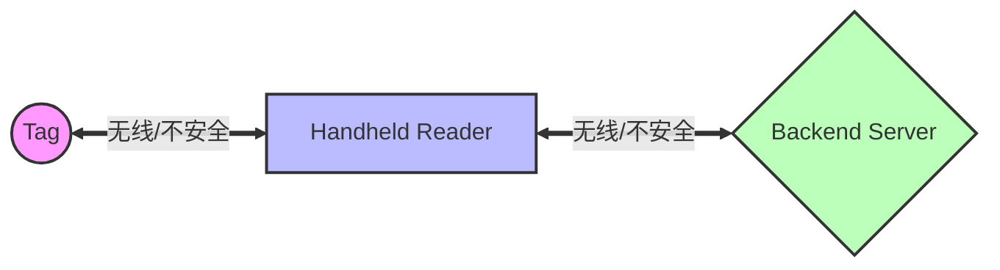
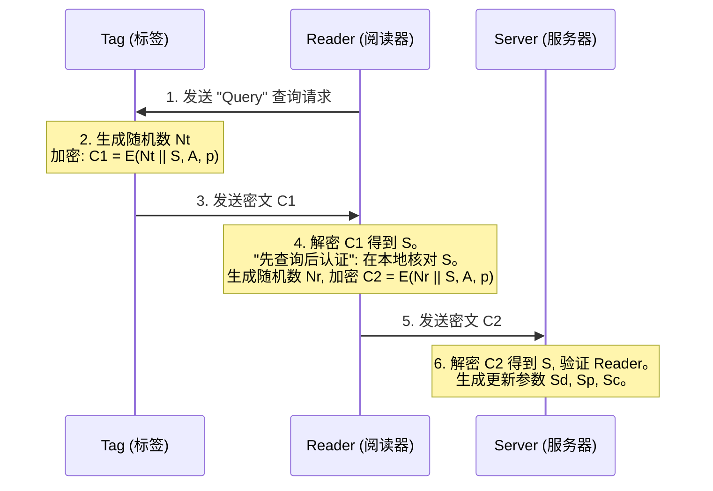
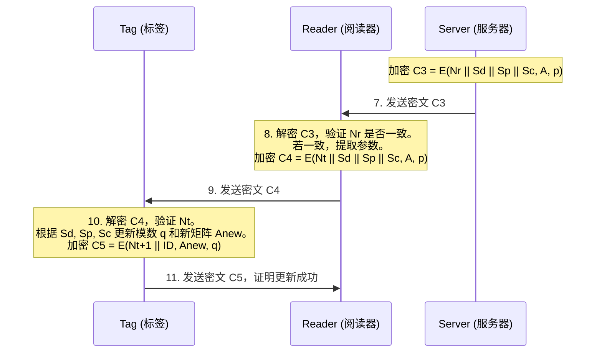

## 基于块-阶-模可变矩阵加密算法的新型RFID认证协议

  
    
A Novel RFID Authentication Protocol Based on a Block-Order-Modulus Variable Matrix Encryption Algorithm

    
论文分享与核心创新点解读

    
IEEE TRANSACTIONS ON INFORMATION FORENSICS AND SECURITY, 2025

  

  <button @click="$slidev.nav.openInEditor()" title="Open in Editor" class="text-xl slidev-icon-btn opacity-50 !border-none !hover:text-white">
    <carbon:edit />
  </button>

---

# 目录

  <Toc></Toc>

---
layout: center
class: text-center
---

# 研究背景与挑战

低成本标签与移动RFID系统

---

## 什么是移动 RFID 系统？

传统的 RFID 系统通常使用固定的阅读器（Reader），阅读器与后端服务器（Server）之间的通信被认为是安全且有线的。

但在**移动 RFID 系统**中，阅读器为便携式或手持设备（例如物流扫码终端），由此引入以下特性：
- **无线通信**：阅读器与服务器之间通过无线信道通信，存在被窃听的风险。
- **动态拓扑**：标签（Tag）、阅读器与服务器之间的物理位置可能持续变化。
- **安全性需求**：需在服务器-阅读器、阅读器-标签两个环节均实现**双向认证**（Two-way Authentication）。

  

  

---

## 低成本标签的安全困境

RFID 标签（如商品溯源标签）的硬件成本受限，其**计算能力与存储空间均较为有限**。

<h3 class="text-red-500">❌ 传统成熟加密算法</h3>
<ul>
  <li>如 <b>ECC, RSA</b> 等非对称加密。</li>
  <li>需要数千甚至上万个逻辑门。</li>
  <li><b>局限：</b> 计算开销较大，低成本标签难以承载。</li>
</ul>

<h3 class="text-orange-500">⚠️ 轻量级哈希/位运算</h3>
<ul>
  <li>如 XOR, 位移, 简单 Hash。</li>
  <li><b>局限：</b> 安全强度较弱，难以抵抗去同步、伪造、重放等攻击。</li>
</ul>

  
💡 矩阵加密算法（Matrix Encryption）

  
矩阵加密在计算开销与安全性之间提供了折中方案。然而传统矩阵加密通常采用<b>固定的密钥矩阵和模数</b>，密钥空间有限。若通过预存大量备用矩阵以增强密钥多样性，将<b>显著增加标签的存储开销</b>。

---
layout: center
class: text-center
---

# 核心创新：三大可变矩阵加密算法

在不增加存储开销的前提下提升安全性

---

## 设计思路：在不增加存储开销的前提下扩充密钥空间

论文的基本思路是：在标签存储受限的条件下，借助**数学变换**，由少量基础矩阵与参数动态生成大量等效的新矩阵。

  

    
🔢

    <h3 class="font-bold">AM 算法</h3>
    
自适应模数 (Adaptive Modulus)

    
更新模数

  

  

    
🔄

    <h3 class="font-bold">SUEO 算法</h3>
    
自更新加密顺序 (Self-Updating Order)

    
更新加密乘法顺序

  

  

    
🔀

    <h3 class="font-bold">DBLTKM 算法</h3>
    
对角块局部转置 (Block Local Transpose)

    
更新密钥矩阵结构

  

---

## AM 算法：自适应模数

**原理**：在传统矩阵加密中，密文 c = A &times; t (mod p)。模数 p 是固定的。
AM 算法表明，若 A 在模 p 下存在逆矩阵，则在 p 的**任意整数因子** q 下同样存在逆矩阵。

<b>引理：</b> 若 det(A) 与 p 互质，且 q 是 p 的约数，则 det(A) 与 q 也互质。

<b>执行流程：</b>

<ol class="text-sm">
  <li>提前设定一个合数 p。</li>
  <li>找出 p 的所有正整数约数集合。</li>
  <li>根据当前的私密值 S，动态选择其中一个约数 q 作为当前的加密模数。</li>
</ol>

  

    
p = 16

    

      q=2
      q=4
      q=8
    

  

  <b>性质：</b> 攻击者即便截获当前模数 q，亦无法反推上一轮或下一轮所使用的模数，并且无需额外存储模数表。

---

## SUEO 算法：自更新加密顺序

**原理**：矩阵乘法**不满足交换律**（A &times; B &ne; B &times; A）。
若存在 N 个基本矩阵，通过改变其连乘顺序，可生成数量可观的复合矩阵。

  <mermaid>
  graph LR
      A[Matrix A] -->|x| B[Matrix B] -->|Result| AB[Matrix AB]
      B2[Matrix B] -->|x| A2[Matrix A] -->|Result| BA[Matrix BA]
      AB -.->|≠| BA
  </mermaid>

**计算复杂度与 Winograd 加速**：
- 矩阵连乘会引入较多乘法运算，对低成本标签的算力构成显著负担。
- **解决方法**：引入 **Winograd 快速卷积算法**，通过代数重构将部分**乘法运算转换为加法运算**（标签端加法的能耗显著低于乘法）。
- **效果**：在 n=18 维矩阵情形下，Winograd 算法使乘法操作数减少约 **44.44%**。

---

## 插页：什么是 Winograd 快速卷积算法？

  C =
  
    ab
    cd
  
  &times;
  
    ef
    gh
  
  =
  
    C11C12
    C21C22
  
  如何用最少的乘法得到这 4 个结果元素？

❌ 朴素算法

  C11 = <b class="text-red-600">a·e</b> + <b class="text-red-600">b·g</b>
  C12 = <b class="text-red-600">a·f</b> + <b class="text-red-600">b·h</b>
  C21 = <b class="text-red-600">c·e</b> + <b class="text-red-600">d·g</b>
  C22 = <b class="text-red-600">c·f</b> + <b class="text-red-600">d·h</b>

<b>8 次乘法</b> + 4 次加法

✅ Strassen：先算 7 个中间量

  P1 = <b class="text-green-700">(a+d)(e+h)</b>
  P2 = <b class="text-green-700">(c+d) · e</b>
  P3 = <b class="text-green-700">a · (f−h)</b>
  P4 = <b class="text-green-700">d · (g−e)</b>
  P5 = <b class="text-green-700">(a+b) · h</b>
  P6 = <b class="text-green-700">(c−a)(e+f)</b>
  P7 = <b class="text-green-700">(b−d)(g+h)</b>
  

<b>7 次乘法</b> + 18 次加法

再用加减组合出 <b>同样的</b> 4 个结果：&nbsp;
C11=P1+P4−P5+P7，&nbsp;
C12=P3+P5，&nbsp;
C21=P2+P4，&nbsp;
C22=P1−P2+P3+P6

<b>要点：</b>两边 C11~C22 完全相同，但右边乘法从 8 次减到 7 次。硬件上一次乘法功耗 ≫ 一次加法，所以这笔交换划算；递归到 n=18 时乘法整体减少约 <b>44.44%</b>。

---

## DBLTKM 算法：对角块局部转置

**原理**：利用矩阵分块（Block）和转置（Transpose）的数学性质。
det(AT) = det(A)，且对角分块矩阵的行列式等于各分块行列式的乘积。

通过对存储的 N 个矩阵在主对角线上排列，并对部分子矩阵执行**转置**操作，可构造出数量极大的新矩阵。
  
由于矩阵 A 存在逆矩阵，其转置 AT 同样可逆，因此所构造的分块矩阵仍可正确解密。

  
块矩阵构造示例

  <table class="m-auto border-collapse border border-gray-400">
    <tbody>
      <tr>
        <td class="border border-gray-400 p-2 bg-blue-200 dark:bg-blue-800">A1</td>
        <td class="border border-gray-400 p-2">0</td>
      </tr>
      <tr>
        <td class="border border-gray-400 p-2">0</td>
        <td class="border border-gray-400 p-2 bg-green-200 dark:bg-green-800">A2T</td>
      </tr>
    </tbody>
  </table>

  <b>说明：</b> 仅需存储少量基础矩阵，通过排列组合与转置即可使密钥空间（Key Space）按指数规模扩展，而标签端的存储开销基本不增加。

---

## 联合算法：AM-SUEO-DBLTKM

将上述三种算法组合，构成最终的**联合加密算法**。
在每一轮认证交互结束后，协议根据通信过程中的随机数与共享密钥，动态确定下一轮所使用的：
1. **块矩阵构造方式**（DBLTKM）
2. **加密乘法顺序**（SUEO）
3. **使用的模数 q**（AM）

<CryptoAnim />

---
layout: center
class: text-center
---

# 协议设计

AM-SUEO-DBLTKM-RFID 身份认证协议

---

## 协议实体与预共享信息

该双向认证协议包含三个实体：**标签 (Tag)**，**阅读器 (Reader)**，**服务器 (Server)**。
三方在初始化阶段预共享了基础密钥矩阵与索引表。

  

    <h3 class="font-bold mb-2 text-blue-500">Tag</h3>
    <ul class="list-disc pl-4">
      <li>加密矩阵 A, B</li>
      <li>初始模数 p</li>
      <li>标签私密值 S</li>
      <li>AM/SUEO/DBLTKM 索引表</li>
    </ul>
  

  

    <h3 class="font-bold mb-2 text-green-500">Reader</h3>
    <ul class="list-disc pl-4">
      <li>解密矩阵 A-1, B-1</li>
      <li>所有标签的私密值 S</li>
      <li>AM/SUEO/DBLTKM 索引表</li>
    </ul>
  

  

    <h3 class="font-bold mb-2 text-purple-500">Server</h3>
    <ul class="list-disc pl-4">
      <li>与Reader同样的解密参数</li>
      <li>负责生成更新密钥</li>
      <li>完整的数据库后端</li>
    </ul>
  

---

## 协议流程图 (1/2)：查询与上行认证

  <b>核心机制：先查询后认证 (Query before authentication)</b> 
  阅读器解密后须在本地数据库中检索到合法的私密值 S 方可继续通信，可有效抵抗 <b>DoS 拒绝服务攻击</b>（来自恶意标签的非法数据会被直接丢弃）。

---

## 协议流程图 (2/2)：下行认证与密钥自更新

  在第 10 步之后，加密体系（矩阵顺序、分块结构、模数）根据 Sd, Sp, Sc 完成更新，下一轮通信将基于新的矩阵参数进行。

---

## 协议完整流程展示：双向认证与自更新

<ProtocolAnim />

  <b>核心机制：先查询后认证 (Query before authentication)</b> 
  阅读器解密后须在本地核对 S 方可继续通信，可有效抵抗 DoS 攻击。下行认证完成后，加密参数依据 Sd, Sp, Sc 完成更新，下一轮通信将基于新的矩阵参数进行。

---
layout: center
class: text-center
---

# 安全性分析与形式化证明

安全性论证与攻击模型分析

---

## 形式化证明：BAN 逻辑 (BAN Logic)

为从形式化逻辑层面论证协议的安全性，论文采用 **BAN 逻辑** 进行验证。

<b>证明目标：</b> 
1. 阅读器相信标签发送了随机数 Nt 和密钥 S。 
2. 服务器相信阅读器发送了 Nr 和 S。 
3. 标签和阅读器相信收到了合法的更新参数 Sd, Sp, Sc。

<code>
推理过程示意： 
从 M1, A1 和 R1 导出：R|≡ T|~{Nt || S} 
从 A2 和 R4 导出：R|≡ #{Nt || S} 
结合新鲜性 R2，导出：R|≡ T|≡{Nt || S} 
最终达成目标 G1：R|≡{Nt || S}
</code>

  结论：BAN 逻辑推导可形成闭环，从形式化层面证明了三方之间的相互认证（Mutual Authentication）成立。

---

## 抵御典型攻击机制

通过三种可变矩阵加密算法与随机数（Nt, Nr）的结合，协议可抵御以下常见 RFID 攻击：

  

    
重放攻击 (Replay Attack)

    
每轮通信均引入新的随机数 N，且加密模数 q 与矩阵结构每轮动态更新，截获的历史密文在后续轮次中不可重用。

  

  

    
去同步攻击 (De-synchronization)

    
标签与阅读器预存索引表，即便某次握手中断导致状态不同步，双方亦可回退至上一轮参数重新协商。

  

  

    
前向安全性 (Forward Secrecy)

    
合数模数 p 的约数 q 具有不可反推性（见图）。攻击者即便获取当前模数 q，也无法反推合数 p 及其他因子。

  

  

    
位置追踪 (Location Tracking)

    
每次返回的密文均由新随机数与自更新矩阵生成，密文呈现伪随机特征，难以通过指纹特征对特定标签进行物理追踪。

  

---
layout: center
class: text-center
---

# 性能评估与对比

存储与计算复杂度对比

---

## 标签存储开销对比 (Tag Storage Overhead)

在保持等效密钥空间规模的前提下，传统算法与本文所提出的**联合算法**在标签存储开销上存在显著差异。

传统无优化算法的存储量：

Straditional = C(2N) &times; ZAM &times; (2n)2 + ... + C(2N)N &times; ZAM &times; (Nn)2 + 1

AM-SUEO-DBLTKM 联合算法的存储量（仅需保存少量基础矩阵）：

Sproposed = N &times; n2 + ZAM + ZSUEO + ZDBLTKM

**存储节省率 (K) 测试结果**：
当基础密钥矩阵数 N=2、明文长度 n=2、模数因子数 Q=2 时，联合算法的标签存储节省率达到 **99.59%**；随参数规模扩大，节省率趋近于 **99.9%**。

---

## 计算复杂度优化 (Computational Complexity)

对于低成本 RFID 标签而言，计算资源往往比存储资源更为紧张。
其中矩阵乘法所涉及的 **乘法门（Multiplication Gates）** 功耗较高。

  

    
Winograd 算法加速

    <ul class="text-sm list-disc pl-4 space-y-2">
      <li>传统矩阵乘法：n3 次乘法</li>
      <li>Winograd 加速：乘法次数减少，部分被替换为低功耗的加法操作</li>
      <li>在 n=18 维度下，乘法操作减少约 <b>44.44%</b></li>
      <li>加法操作约增加 15%</li>
    </ul>
  

  
  

    

      
📉 -44%

      
Multiplication Cost

    

  

---
layout: center
class: text-center
---

# 总结

Conclusions

---

## 论文核心贡献总结

1. **三种轻量级矩阵变换机制：**
   - 提出 AM（模数自适应）、SUEO（乘法顺序自更新）、DBLTKM（块对角局部转置）三种加密机制，在**不增加额外存储**的前提下，使矩阵密钥空间呈指数级扩展。

2. **面向标签端的计算优化：**
   - 引入 **Winograd 快速卷积算法**，以少量加法运算的增加换取近一半乘法开销的降低，缓解了矩阵加密在低成本标签上的计算压力。

3. **双向认证协议设计：**
   - 设计了完整的 `AM-SUEO-DBLTKM-RFID` 移动协议流程。
   - 通过 BAN 逻辑完成形式化正确性证明，在保持安全强度的同时实现 **99.59%** 的存储节省，适用于资源受限的 IoT 与 6G 移动传感网络场景。

---
layout: center
class: text-center
---

# Thanks for Watching

感谢观看

